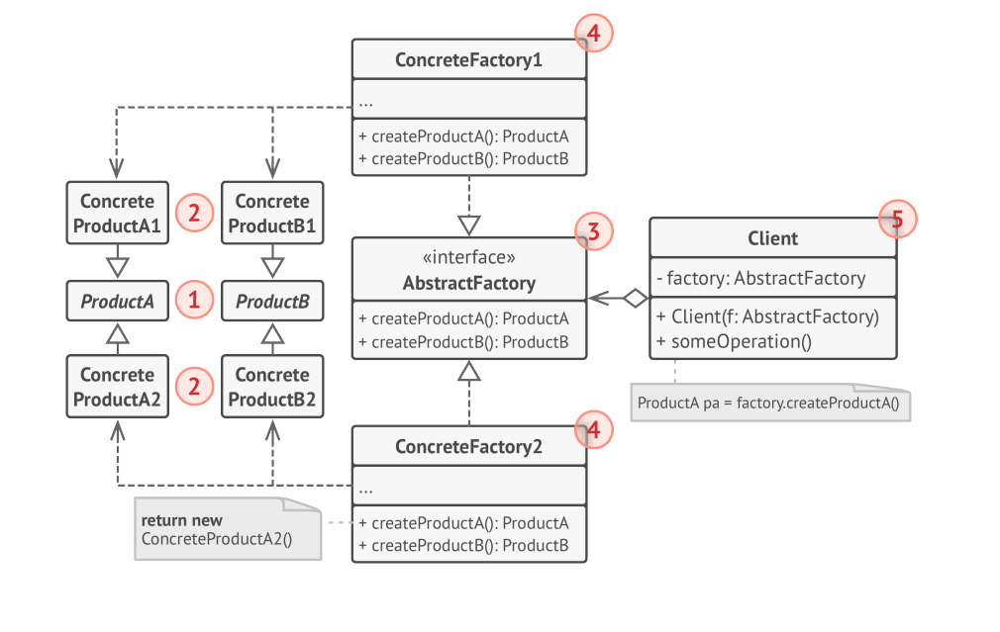

# Abstract-factory-design-pattern

* The Abstract Factory Pattern provides an interface for creating families of related or dependent objects without specifying their concrete classes.

* The Abstract Factory Pattern is also known as Kit.

## Structural diagram :

## Abstract Factory Design Pattern uses:

* The Abstract Factory Pattern is used when we need to create a family of related objects and we don't know the exact class of the objects at compile time.

* The Abstract Factory Pattern is also used when we want to provide a library of objects that can be used by client applications but we don't want to expose the implementation details of the library to the client applications.

* The Abstract Factory Pattern is also used when we want to decouple the implementation of an application from the client applications that use it.

